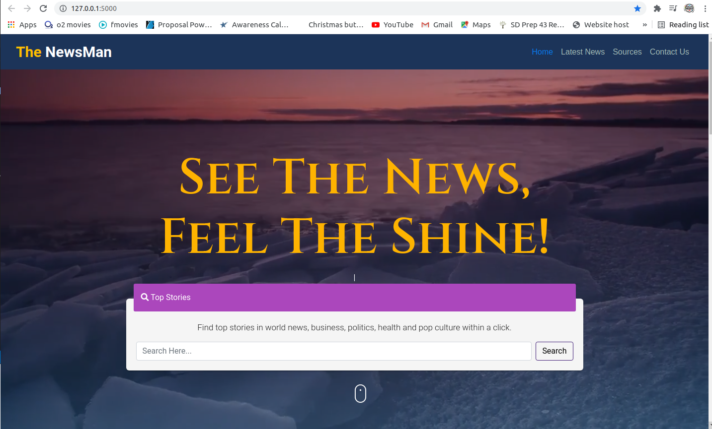
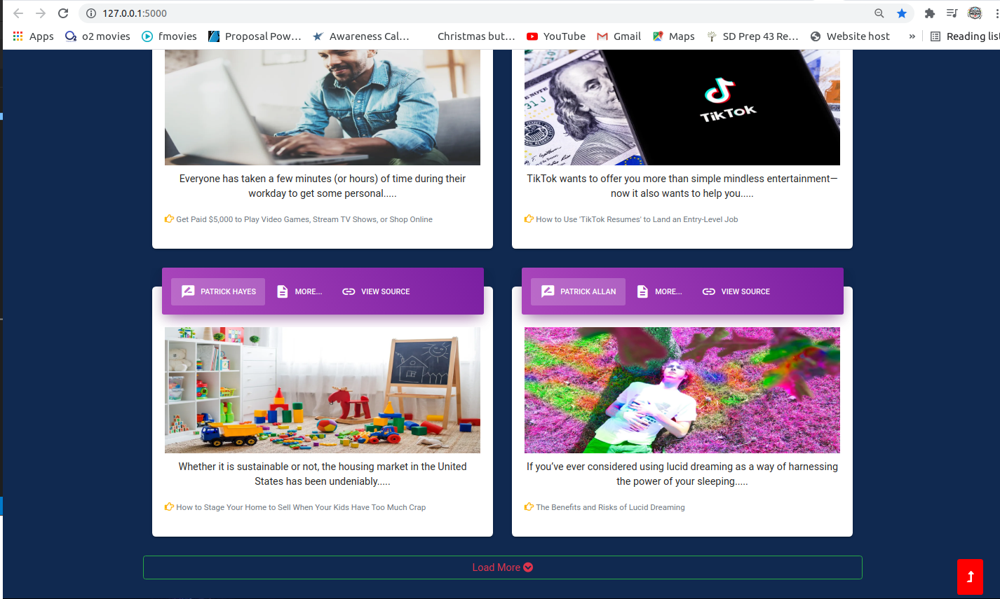
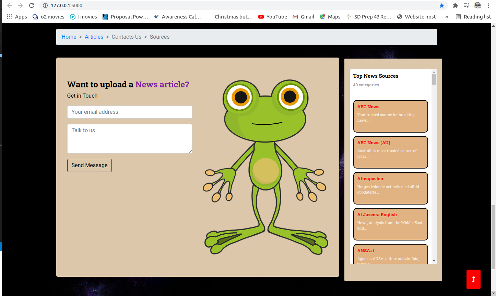
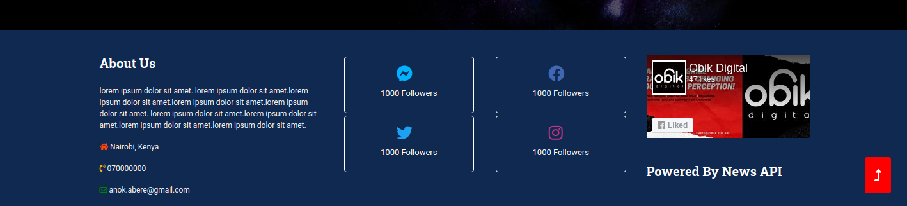

# The NewsMan
## Project Description
An application that lists various news sources and articles by sending requests to the news api. 
##### By Enock Abere 

###### Dated 16/08/2021.
## Description
The application consumes the NewsAPI hence the application provides the following functionalities to users:

- Have access to news sources. The user has access to over 50 news sources of various categories. These are displayed on the landing page in card format for each news source.
- Search for articles from all around the world. The user can search for an article by keyword.
### Hero Section
    The application contains a navigation bar, a slogan and a brief description text on the hero section of the landing page, a search form and a scroll down button to the articles section.
#### Hero Section BDD
* By clicking on ***Nav Tabs*** the page scroll the visitor to the selected section.

* Page visitor should enter a search query on the form about any subject of interest followed by clicking the search button then click on the scroll down button to see the search results.
#### Hero Section Visual

### Articles Section
    The section shows results of the search query where every article is in a card with tabs. The section has a breadcrumb for easy navigation to the homepage incase the visitor wants to search again. The section has a container to display random ads.
#### Articles Section BDD
* By clicking on the first tab on the article card the visitor should see the searched article author on the tab, (article image, description and title) respectively on the card body

* Clicking on the second tab the visitor should see the article content and published date on the card body.

* Clicking on the third tab which is a link the visitor should be redirected to the page where the article is published.
* The section is set to display four articles by default, more articles can be accessed by clicking the load more button at the bottom of the page
#### Hero Section Visual

##### Hero Section Article Card Visual

### Sources Section
    The section has a scrollable list of all the news sources available. and a contacts form.
#### Sources Section BDD
* Scroll up/down to find the source you want to visit and click on it to navigate.
#### Sources Section Visual

### Footer Section
    Footer contains a brief description about the site, social media links and facebook plugin.
#### Footer Section Visual

### 404 Error Page

#### Description
    This is an error page indicating that the browser was able to communicate with server but not able to find the requested page.

#### Behavior Driven Development
* The page will ask the visitor whether he/she wishes to navigate back to the Landing page. If yes, the visitor will be redirected to the landing page and if No the user will get an alert asking him/her to close the page.

#### 404 Error Page Display

### Live link
Visit the application on https://the-news-man.herokuapp.com/
### Development
#### Making modifications
To make advancements/modifications, follow these steps:
- Fork the repository
- Create a new branch (git checkout -b improve-feature)
- Make the appropriate changes in the files
- Add changes made
- Commit your changes (git commit -am 'Improve feature')
- Push to the branch (git push origin improve-feature)
- Create a Pull Request
### Technologies Used
Technologies used to develop this application:
- Python v3.7
- Flask 1.1.2
- Flask-Bootstrap
- HTML
- CSS
### Support and contact details
Should you be unable to access the website, have any recommendations and/or questions, feel free to email me:[anock.abere@student.moringaschool.com](mailto:anock.abere@student.moringaschool.com)
### License
    ​Permission is hereby granted, free of charge, to any person obtaining a copy of this software and associated documentation files (the "Software"), to deal in the Software without restriction, including without limitation the rights to use, copy, modify, merge, publish, distribute, sublicense, and/or sell copies of the Software, and to permit persons to whom the Software is furnished to do so, subject to the following conditions:​The above copyright notice and this permission notice shall be included in all copies or substantial portions of the Software.

    ​THE SOFTWARE IS PROVIDED "AS IS", WITHOUT WARRANTY OF ANY KIND, EXPRESS OR IMPLIED, INCLUDING BUT NOT LIMITED TO THE WARRANTIES OF MERCHANTABILITY, FITNESS FOR A PARTICULAR PURPOSE AND NONINFRINGEMENT. IN NO EVENT SHALL THE AUTHORS OR COPYRIGHT HOLDERS BE LIABLE FOR ANY CLAIM, DAMAGES OR OTHER LIABILITY, WHETHER IN AN ACTION OF CONTRACT, TORT OR OTHERWISE, ARISING FROM, OUT OF OR IN CONNECTION WITH THE SOFTWARE OR THE USE OR OTHER DEALINGS IN THE SOFTWARE

Copyright (c) 2021 [Enock Abere](https://github.com/enockabere)  
